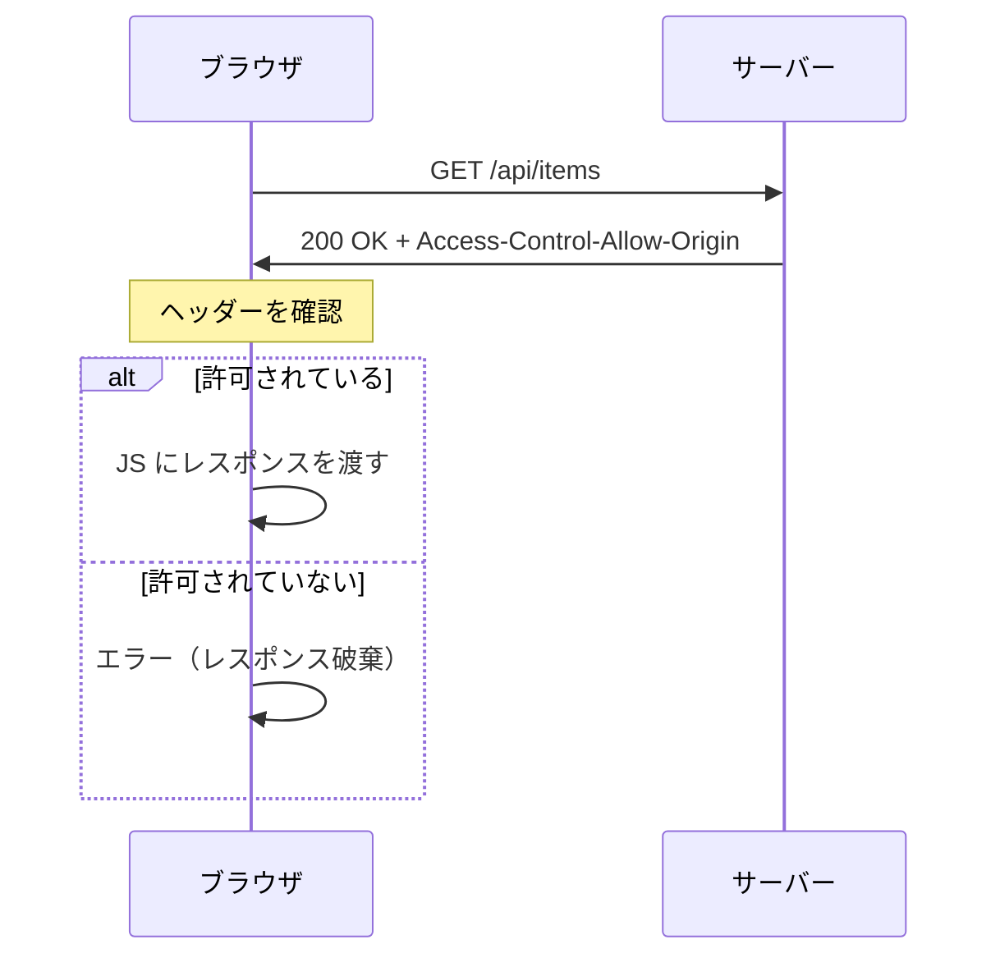
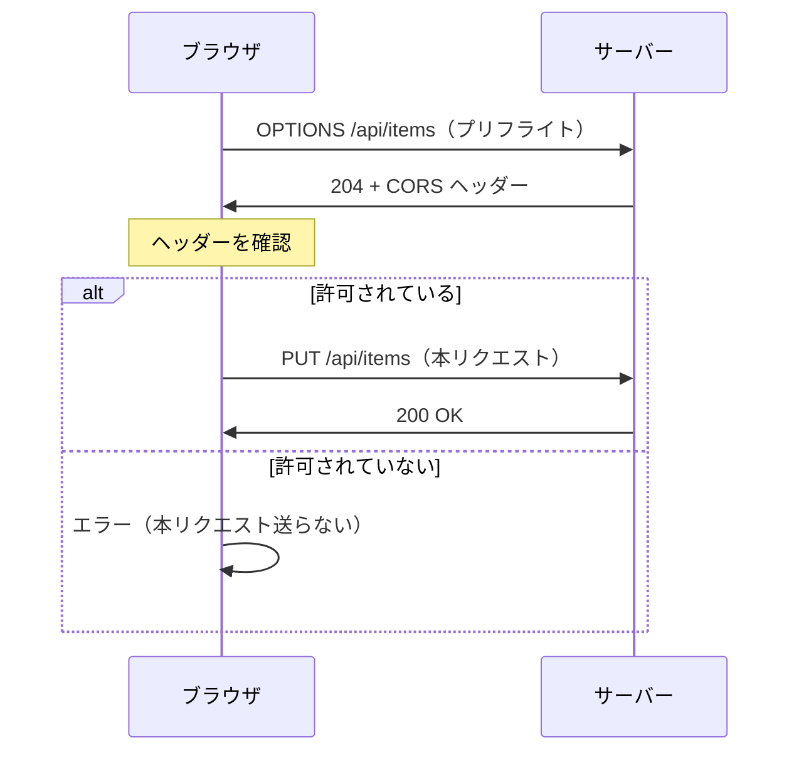

## CORS テスト（AWS + Terraform）

- `front` — TypeScript(Express) の簡易フロントエンド。任意のバックエンドオリジンへリクエストを送って結果を確認できる静的ページを提供します。
- `back` — TypeScript(Express) 製の簡易バックエンド。`/api/ping` に対して CORS ヘッダ（OPTIONS のプリフライト対応を含む）を付けて応答します。
- `terraform` — ECR、VPC、サブネット、ALB、ECS Fargate、IAM ロール、CloudWatch Logs などを作成する Terraform 構成（最小構成）。

## ローカルでの実行方法

### Back（ローカル）

- `back`リポジトリを参照

### Front（ローカル）

- `front`リポジトリを参照

### Docker Compose で両方を起動

簡単にフロントとバックの両方を起動してテストしたい場合は、Makefile を使います:

```bash
make up      # ビルド＆起動
make down    # 停止
make logs    # ログ表示
```

その後、ブラウザで `http://localhost:13000` を開き、バックエンド欄に `http://localhost:18080` を入力して動作を確認してください。

> 注: ポートは個別の `docker run` と衝突しないよう 13000/18080 にしています。

## Terraform による AWS へのデプロイ

事前準備:

- AWS 認証情報が設定されていること, `AWS_RPPOFILE`を利用すること（環境変数 または `~/.aws/credentials`）。

実行の例:

```bash
cd terraform
terraform init
terraform validate
terraform plan -var='aws_region=ap-northeast-1'
terraform apply -var='aws_region=ap-northeast-1'
```

実行に成功すると、ECR のリポジトリ URL、ALB の DNS 名（`alb_dns_name` 出力）などが出力されます。

> ヒント: Terraform 実行中に権限エラーが出る場合は `aws sts get-caller-identity` で現在の認証情報を確認し、必要なポリシーを付与してください。

## CORS テストについて

- ブラウザでの CORS 挙動確認は「**異なるホスト名**」でアクセスすることがポイントです（例: `front.example.com` と `api.example.com`）。
- テスト段階では ALB の DNS 名をそのまま使って、フロントとバックで異なるホスト名／ポートを用いることで検証できます。
- HTTPS は必須ではありませんが、フロントが HTTPS の場合はバックも HTTPS にしないと混合コンテンツでブロックされます。

## 今後の予定

- GitHub Actions での CI: イメージビルド →ECR push→ECS サービス更新のワークフローを追加予定です。
- 必要に応じてリソース（タスクサイズ、desired_count など）を `terraform/variables.tf` で調整してください。


## CORS について

CORS（Cross-Origin Resource Sharing）は、ブラウザが異なるオリジン間でリソースを共有する際のセキュリティ機構。

### オリジンとは

`スキーム + ホスト + ポート` の組み合わせ。以下は全て異なるオリジン:

- `http://localhost:3000`
- `http://localhost:8080`（ポートが違う）
- `https://localhost:3000`（スキームが違う）

### リクエストの種類

**1. Simple Request（単純リクエスト）**

プリフライトなしで直接送信される。条件:
- メソッド: GET, HEAD, POST のみ
- Content-Type: `text/plain`, `multipart/form-data`, `application/x-www-form-urlencoded` のみ



**2. Preflight Request（プリフライトリクエスト）**

本リクエストの前に OPTIONS で許可を確認。以下の場合に発生:
- PUT, DELETE, PATCH などのメソッド
- カスタムヘッダー（Authorization など）
- `Content-Type: application/json`



### 主要な CORS ヘッダー

| ヘッダー | 役割 |
|---------|------|
| `Access-Control-Allow-Origin` | 許可するオリジン（`*` で全許可） |
| `Access-Control-Allow-Methods` | 許可するメソッド |
| `Access-Control-Allow-Headers` | 許可するヘッダー |
| `Access-Control-Allow-Credentials` | Cookie 送信許可 |
| `Access-Control-Max-Age` | プリフライト結果のキャッシュ秒数 |

### このプロジェクトでの設定

`back/src/index.ts` の `CORS_ENABLED` で許可/拒否を切り替え可能。


## AWS での CORS 対応

### 各サービスの CORS 対応状況

| サービス | CORS 対応 | プリフライト (OPTIONS) |
|---------|----------|----------------------|
| ECS / Fargate | ❌ なし | アプリで処理 |
| ALB | ❌ なし | アプリで処理 |
| API Gateway | ✅ 設定可能 | 自動応答 |
| CloudFront | ✅ ヘッダー付与のみ | アプリで処理 |

### API Gateway の場合

CORS を有効にすると、プリフライト用の OPTIONS レスポンスを自動生成。バックエンドにリクエストを転送せずに API Gateway が直接応答する。

```
[ブラウザ] --OPTIONS--> [API Gateway] ← ここで応答（バックエンド不要）
[ブラウザ] --GET------> [API Gateway] --> [ECS]
```

### CloudFront の場合

レスポンスヘッダーポリシーで CORS ヘッダーを付与できるが、OPTIONS リクエストはオリジン（ALB/ECS）に転送される。アプリ側で OPTIONS を処理する必要あり。

```
[ブラウザ] --OPTIONS--> [CloudFront] --> [ALB] --> [ECS] ← アプリで処理
[ブラウザ] --GET------> [CloudFront] --> [ALB] --> [ECS]
```

### このプロジェクトの構成（ALB → ECS）

ALB も ECS も CORS を処理しないため、アプリ側（`back/src/index.ts`）で対応している。
